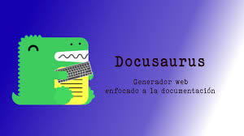

# <mark>Crea una Web de documentacion con Docusaurus  </mark>



[Docusaurus](https://docusaurus.io/)


---


## 1. CREAR PAGINA

 

 

>Abrir la consola  <mark>cmd</mark> situada en la carpeta del proyecto escribimos el comando, para crear la Pagina.
~~~sh
 npx create-docusaurus@latest myWeb classic
~~~
 
---


~~~ 
 
[SUCCESS] Created myWeb.
[INFO] Inside that directory, you can run several commands:

  `npm start`
    Starts the development server.

  `npm run build`
    Bundles your website into static files for production.

  `npm run serve`
    Serves the built website locally.

  `npm deploy`
    Publishes the website to GitHub pages.

We recommend that you begin by typing:

  `cd myWeb`
  `npm start`

Happy building awesome websites!
~~~


---

### ENTRAR EN LA CARPETA CREADA.

>En la consola situada en la carpeta del proyecto escribimos el comando
~~~sh
 cd myWeb
~~~
---

### ABRIR PROYECTO EN VSCODE.

>En la consola situada en la carpeta del proyecto escribimos el comando
~~~sh
 code .
~~~
---
 
### START YOUR SITE.
ABRIR TERMINAL EN VSCODE.
>En la consola situada en la carpeta del proyecto escribimos el comando
~~~sh
 npm start
~~~

----

~~~
[INFO] Starting the development server...
[SUCCESS] Docusaurus website is running at: http://localhost:3000/

✔ Client
  Compiled successfully in 15.42s

client (webpack 5.85.0) compiled successfully
~~~
---

---

## 2. CONFIGURAR ARCHIVO: docusaurus.config.js


---

 

> docusaurus.config.js y modificar.
```json
  url: 'https://juamaya.github.io',
  baseUrl: '/myWeb/',
  organizationName: 'juamaya', // Usually your GitHub org/user name.
  projectName: 'myWeb', // Usually your repo name.
  deploymentBranch: 'gh-pages',
  trailingSlash:false,
```

---
### ABRIR EL TERMINAL EN LA CARPETA DEL PROYECTO EN VSCODE.

> En la consola git-bash situada en la carpeta del proyecto escribimos el comando
```sh
npm run build  (Crea una carpeta llamada build.)
```

---


###  CREAR REPOSITORIO EN GITHUB (myWeb)

- INICIAR GIT (Repositorio Local)

 > En la consola git-bash situada en la carpeta del proyecto escribimos el comando
```sh
git init
git add .
git commit -m "first commit"
```

---

###  SUBIR REPOSITORIO A GITHUB (Repositorio Remoto)

 > En la consola git-bash situada en la carpeta del proyecto escribimos el comando
```sh
git branch -M main
git remote add origin https://github.com/juamaya/myWeb.git
git push -u origin main
```

---


###  SUBIR CAMBIOS AL REPOSITORIO A GITHUB

 > En la consola git-bash situada en la carpeta del proyecto escribimos el comando
```sh
git add .
git commit -m "first change"
git push
```

---


###  VER  TODOS LOS COMMITS

 > En la consola git-bash situada en la carpeta del proyecto escribimos el comando
```sh
git log --oneline --graph --decorate --all
```

---


## 3. PUBLICAR PAGINA EN GITHUB-PAGES.
 

(crea una rama para el deploy.(gh-pages))

> ABRIR EL TERMINAL <mark>  **powershell**  </mark>  EN LA CARPETA DEL PROYECTO EN VSCODE.
```sh
cmd /C 'set "GIT_USER=juamaya" && npm run deploy'
```

---


##  SUBIR CAMBIOS A GITHUB-PAGES.

> ABRIR EL TERMINAL <mark>  **powershell**  </mark> EN LA CARPETA DEL PROYECTO EN VSCODE.
```sh
cmd /C 'set "GIT_USER=juamaya" && npm run deploy'
```

---


# <mark> JUAMAYA 🍺 2024</mark>